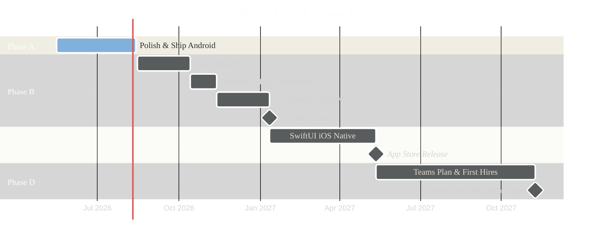
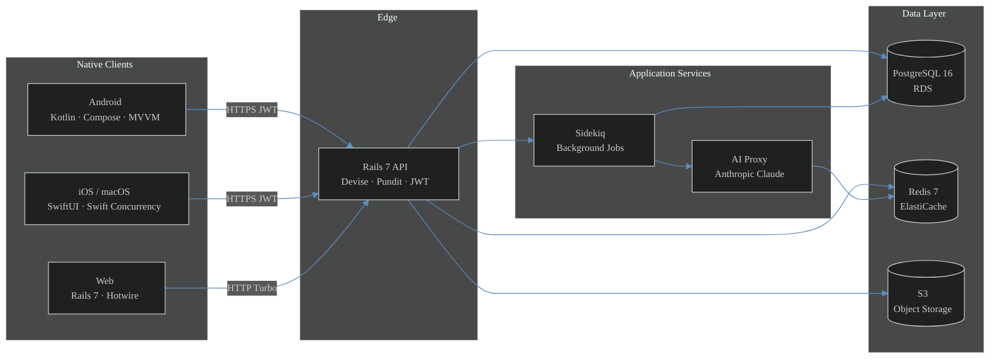

<div align="center">

<picture>
  <source media="(prefers-color-scheme: dark)" srcset="assets/banner.svg">
  <source media="(prefers-color-scheme: light)" srcset="assets/banner.svg">
  
</picture>

<br>

<p align="center">
  <a href="#current-phase"></a>
  <a href="#current-phase"></a>
  <a href="#tech-stack"></a>
  <a href="#tech-stack"></a>
  <a href="#license"></a>
</p>

<p align="center">
  <a href="#the-stance">The Stance</a>
  &nbsp;·&nbsp;
  <a href="#what-is-time">What</a>
  &nbsp;·&nbsp;
  <a href="#current-phase">Status</a>
  &nbsp;·&nbsp;
  <a href="#roadmap">Roadmap</a>
  &nbsp;·&nbsp;
  <a href="#architecture">Architecture</a>
  &nbsp;·&nbsp;
  <a href="#tech-stack">Stack</a>
  &nbsp;·&nbsp;
  <a href="#running-time-locally">Run</a>
  &nbsp;·&nbsp;
  <a href="#how-we-track-progress">Tracking</a>
  &nbsp;·&nbsp;
  <a href="#build-in-public">Build in Public</a>
</p>

</div>

<br>

---

<br>

## The Stance

<table>
<tr>
<td width="60%">

TiME is not just a product. It is a stance.

A stance against urgency that does not serve us.
A stance against optimization that hollows us out.
A stance for stillness, for return, for being.

Modern productivity tools say *"do more, faster."* TiME says: *"This is your time. Take it back."*

If TiME succeeds financially but loses this stance, it has failed. If it succeeds in this stance and only earns modestly, it has won.

</td>
<td width="40%" align="right" valign="top">

```
─────────────────
  Your time,
  returned
  to you.
─────────────────
  あなたの時間を、
  あなたへ。
─────────────────
```

</td>
</tr>
</table>

<br>

## What is TiME

TiME is a calm, AI-augmented time-management system designed for people who want to own their attention rather than be owned by it. Built natively across Android, iOS, and the web, it blends the daily planning ritual of Sunsama, the focus-session execution of Sessions and Structured, and the tactile aesthetic gravity of a Moleskine notebook into a single product that occupies a territory no current competitor holds: the intersection of **calm** and **general**.

The product is built and operated by a single founder under the Source-of-Truth playbook known internally as the BIBLE. Every decision — visual, technical, commercial — is traceable to a Decision Log line. Drift is not permitted.

<br>

<table>
<tr>
<th width="33%">For the Tired Professional</th>
<th width="33%">For the Neurodivergent User</th>
<th width="33%">For the Solo Builder</th>
</tr>
<tr>
<td>

Burned out by infinite todo lists and calendars that demand instead of serve. TiME treats time as something to return to you, not extract from you.

</td>
<td>

Designed from the start to honor different cognitive rhythms. Accessibility is a first-class requirement, not a final-quarter checklist.

</td>
<td>

Built by one founder using AI as a force multiplier. The story of TiME is itself a public case study of solo-founder + AI execution at scale.

</td>
</tr>
</table>

<br>

## Current Phase

<table>
<tr>
<td width="65%">

> **PHASE A — POLISH AND SHIP ANDROID**
> Months 0 to 3 · 2026-05-16 to 2026-08-14 · 13 weeks
>
> Take the existing Android app from "works in IDE" to "50 to 100 users on Play Store closed alpha." Firebase carries this phase. Repository interfaces are extracted to prepare for the Phase B Rails migration. AI features wait until Phase B.

</td>
<td width="35%" valign="top">

```
PHASE A  ▰▱▱▱▱▱▱▱▱▱  ~5%
PHASE B  ▱▱▱▱▱▱▱▱▱▱   0%
PHASE C  ▱▱▱▱▱▱▱▱▱▱   0%
PHASE D  ▱▱▱▱▱▱▱▱▱▱   0%
```

```
Last reviewed   2026-05-23
Next checkpoint 2026-08-14
```

</td>
</tr>
</table>

**Active deliverables (Phase A):**

| Area | Item | Tracked in YouTrack |
|---|---|---|
| Security | User-scoped Firestore (replace global `time_entries` collection) | `TIME-001` |
| Architecture | Extract `TimeRepository` and `CategoryRepository` interfaces | `TIME-002` |
| Architecture | Migrate to Hilt dependency injection | `TIME-003` |
| Auth | Surface Firebase Auth (email, Google, Apple) in UI | `TIME-004` |
| Onboarding | 60-second first-run experience | `TIME-005` |
| i18n | Externalize all strings + Japanese translation | `TIME-006` |
| Quality | Sentry / Crashlytics integration | `TIME-007` |
| Quality | GitHub Actions CI (ktlint, detekt, lint, tests, build) | `TIME-008` |
| Compliance | Privacy Policy and Terms of Service | `TIME-009` |
| Distribution | Play Store closed alpha submission | `TIME-010` |

Full Phase A breakdown lives in [`ROADMAP.md`](ROADMAP.md) and tracked as tickets in our YouTrack instance (see [How we track progress](#how-we-track-progress)).

<br>

## Roadmap



**Long-term valuation glide path:**

| Year | Target ARR | Target Valuation | Key Milestone |
|---|---|---|---|
| Y1 (2026-27) | $200K to $1M | $5M to $30M | Validated product |
| Y2 (2027-28) | $3M to $10M | $30M to $100M | Multi-platform plus Teams |
| Y3 (2028-29) | $15M to $30M | $100M to $300M | Enterprise traction |
| Y4 (2029-30) | $35M to $60M | $300M to $600M | International expansion |
| Y5 (2030-31) | $70M to $120M | $600M to $1.2B | **Billion crossed** |
| Y6+ | scale | $1.3B+ | Profitable scale, IPO consideration |

<br>

## Architecture



<sub>Phase A is a transitional architecture: Android speaks directly to Firebase Firestore. Phase B introduces the Rails API and migrates each repository class behind an already-extracted interface. Firebase is fully removed at the end of Phase B.</sub>

<br>

## Tech Stack

<table>
<tr>
<th width="20%">Layer</th>
<th width="40%">Current (Phase A)</th>
<th width="40%">Target (Phase B and beyond)</th>
</tr>
<tr>
<td><b>Android</b></td>
<td>Kotlin 1.9 · Jetpack Compose · MVVM · DataStore · Firebase Firestore · Firebase Auth · Lottie · Coil</td>
<td>Above plus Hilt DI · Retrofit · Sentry · WorkManager · Coil only (Glide removed)</td>
</tr>
<tr>
<td><b>iOS / macOS</b></td>
<td>Not started</td>
<td>SwiftUI native · Swift Concurrency · SwiftData · StoreKit 2 · WidgetKit · ActivityKit</td>
</tr>
<tr>
<td><b>Web + Backend</b></td>
<td>Not started</td>
<td>Ruby 3.3 · Rails 7.2 · Hotwire (Turbo + Stimulus) · PostgreSQL 16 · Redis 7 · Sidekiq · Devise + JWT · Pundit · Active Storage · S3</td>
</tr>
<tr>
<td><b>AI</b></td>
<td>Not yet</td>
<td>Anthropic Claude API via Rails proxy · Haiku 4.5 for cost · Sonnet 4.6 for quality · PG / Redis caching</td>
</tr>
<tr>
<td><b>Infra</b></td>
<td>Firebase free tier</td>
<td>AWS · ECS Fargate or App Runner · RDS · ElastiCache · S3 · CloudFront</td>
</tr>
<tr>
<td><b>CI / CD</b></td>
<td>None</td>
<td>GitHub Actions (Android) · CircleCI (Rails) · Dependabot · gitleaks · brakeman</td>
</tr>
<tr>
<td><b>Subscriptions</b></td>
<td>None</td>
<td>RevenueCat (mobile) · Stripe (web) · reconciled in Rails</td>
</tr>
<tr>
<td><b>Observability</b></td>
<td>Firebase Analytics</td>
<td>Sentry (all clients + Rails) · Crashlytics · custom Rails event stream · first-party analytics in Postgres</td>
</tr>
</table>

**Explicitly not in the stack:** Kotlin Multiplatform, React Native, Flutter, Next.js, Spring Boot, Angular, Vue, WebView wrappers, third-party trackers. These were considered and rejected. See the BIBLE Decision Log for reasoning.

<br>

## Running TiME locally

The repository ships an Android Studio project ready to open. Backend code (Rails) joins the repo at the start of Phase B and is not present yet.

**Prerequisites**

| Tool | Version | Notes |
|---|---|---|
| Android Studio | Iguana 2023.2 or later | Required for Compose Compiler 1.5 and Gradle 8.11 |
| JDK | 17 | Bundled with Android Studio is fine |
| Android SDK | API 35 (Android 15) | Compile target |
| Android device or emulator | API 26 (Android 8.0) or higher | Minimum supported |

**Open the project**

```bash
# Clone
git clone git@github.com:watarikai96/TiME.git
cd TiME

# Open in Android Studio
#   File > Open > select the `TiME/` folder (the inner one with build.gradle.kts)
```

**Sync and build**

After Android Studio finishes the initial Gradle sync, run the app from the toolbar (`Run 'app'` or `Shift + F10`). A `google-services.json` is checked into the repository for the development Firebase project; production credentials will be provisioned separately for the Play Store release in Phase A Week 11.

**Common issues**

| Symptom | Cause | Fix |
|---|---|---|
| Crash at startup on Android 14 or earlier | `@RequiresApi(VANILLA_ICE_CREAM)` annotations from a legacy refactor | Tracked as `TIME-011`; will be removed before alpha submission |
| Gradle sync fails on first open | JDK version mismatch | `File > Settings > Build, Execution, Deployment > Build Tools > Gradle` set Gradle JDK to 17 |
| Compose previews blank | Stale cached compiler | `File > Invalidate Caches and Restart` |

<br>

## How we track progress

Three artifacts, three responsibilities. Nothing duplicates.

```
┌──────────────────────────────────────────────────────────────────────┐
│                                                                      │
│   YouTrack          ▸  the truth for TASKS                          │
│   (self-hosted)        every Phase A-D ticket lives here             │
│                        prefix: TIME-XXX                              │
│                                                                      │
│   GitHub            ▸  the truth for CODE                            │
│   (this repo)          commits reference TIME-XXX in messages        │
│                        branches: TIME-XXX/short-slug                 │
│                        PRs auto-link to YouTrack issues              │
│                                                                      │
│   BIBLE.md          ▸  the truth for STRATEGY                        │
│   (private)            philosophy, persona doctrine, roadmap,        │
│                        agent command book — not in this README       │
│                                                                      │
└──────────────────────────────────────────────────────────────────────┘
```

**Why YouTrack and not GitHub Projects:** YouTrack supports the full hierarchy (Epic to Story to Task to Subtask) with native time tracking and is already self-hosted in Docker offline. GitHub Projects is a flat board. We use GitHub strictly for source control and CI; tickets live in YouTrack, where the founder can budget hours against tickets and see velocity against the Phase A 90-day window.

**The two-hour day rule:** Even on a day budgeted for only two hours (typical weekday 20:00 to 22:00 JST window), one YouTrack ticket must be moved at least one column. This is the minimum unit of progress. Some weeks will be heavier (weekend windows allow up to 10 hours per day), but the floor is the floor.

Integration details, branch and commit conventions, and webhook setup all live in [`YOUTRACK_SETUP.md`](YOUTRACK_SETUP.md). Phase A ticket import file lives in [`ROADMAP.md`](ROADMAP.md) and its sibling CSV.

<br>

## Build in Public

This project is built fully in the open. The product source is proprietary (see [License](#license)) but the journey is public.

- **X (Twitter):** [@watarikai96](https://twitter.com/watarikai96) — daily progress, lessons, weekly metrics threads
- **Weekly retrospectives:** every Sunday evening JST, posted as a thread
- **Monthly numbers:** transparent revenue, retention, and active-user counts beginning at first paid user
- **Annual transparency report:** a long-form blog post published at the end of each year

The content rhythm (`3-2-1`): three single posts per day on average, two threads per week, one major milestone post per week. Total time budget for marketing is folded into the founder's locked work windows; nothing is added on top of family or rest.

<br>

## Trademarks and IP

The following names and systems are claimed as unregistered trademarks of TiME Discipline Ltd.

```
TiME App           ™
HyperFocus         ™     (the Pomodoro-evolved focus engine)
QuietCraft Theme   ™     (the custom theming system)
```

Trademark filings in JP and US are budgeted for Year 1; EU follows in Year 2 via Madrid Protocol. Animated clock logo and the bilingual tagline ("Your time, returned to you." / 「あなたの時間を、あなたへ」) are original art under copyright.

<br>

## License

```
TiME DISCIPLINE LTD. PROPRIETARY LICENSE
Copyright © 2024 to 2026. All rights reserved.

1. This software is provided for public release for viewing only.
   No forking, no reuse, no redistribution.
2. Any form of reproduction, distribution, or modification is prohibited
   without explicit written permission from TiME Discipline Ltd.
3. Violators will be pursued legally under applicable copyright law.
```

For licensing or business inquiries: **watarikai@outlook.com**

See [`LICENSE.md`](LICENSE.md) for the full text.

<br>

## Credits

Engineering, design, and product by **Rahul Watari** (`@watarikai96`).
Strategy partner and pair programmer: **Claude** (Anthropic).

<br>

---

<br>

<div align="center">

<sub>Crafted with intent in Tokyo. Solo founder. Locked stack. Tracked tickets. No shortcuts.</sub>

<br><br>

<code>あなたの時間を、あなたへ。 · Your time, returned to you.</code>

<br><br>

<sub><a href="#">Back to top</a></sub>

</div>
